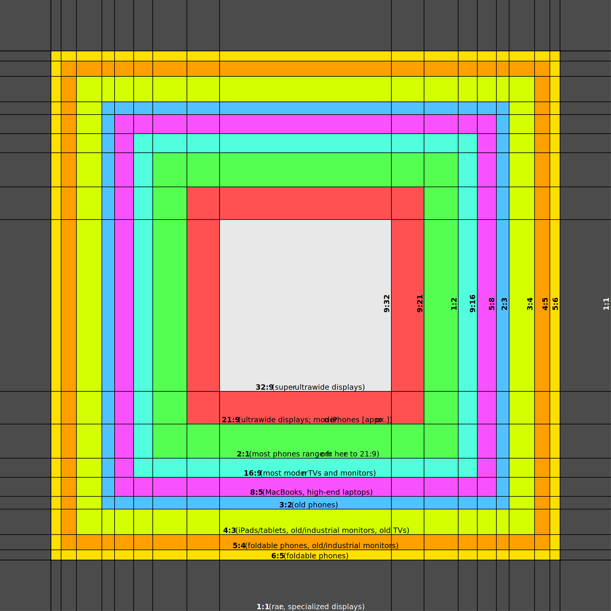

# Universal Screen Content — Specification

## Definition

> **Universal Screen Content** is any screen content which can be properly viewed in either portrait or landscape orientation, up to a given maximum aspect ratio.

"Properly viewed" means:
- All user-critical content is fully visible and unobstructed
- The content is not distorted, stretched, or cropped in a way that impairs comprehension or aesthetics
- The content is legible and functional at any supported orientation

## Scope

USC addresses **non-resizable content** — content with fixed dimensions that cannot reflow, such as raster images and pre-rendered video.

> USC is a platform-agnostic standard. Platform-specific safe zone APIs (OS-level insets for notches and system chrome) and responsive layout conventions address different problems. USC addresses the geometry of aspect-ratio and orientation diversity across unrelated devices and platforms — and a USC-compliant asset requires no platform-specific adjustment.

USC compliance requires:

1. **The content must be square (1:1 aspect ratio).** A square is the only aspect ratio that is self-symmetric under portrait/landscape rotation: centering a square canvas in either orientation produces identical crop geometry. It is therefore the only shape that can satisfy arbitrary aspect ratio and orientation requirements without orientation-specific variants.
2. **All user-critical content must exist within a centered "safe square"** whose size is determined by the maximum supported aspect ratio. Content outside the safe square may be partially or fully cropped on certain screens and must therefore be decorative only.

## Safe Areas

When designing non-resizable USC content, the **safe area** is the largest centered square that remains fully visible on a screen with a given aspect ratio — in both portrait and landscape orientations.

Because the canvas is square (1:1), rotating the viewport between portrait and landscape is equivalent to toggling between a tall and a wide crop of the same square canvas. The safe area at a given aspect ratio `W:H` (where `W ≥ H`) is the region of the square canvas that is visible when the canvas is letterboxed or pillarboxed into a `W:H` rectangle.

For a square canvas of side length `S` displayed on a screen with aspect ratio `W:H`:

- **Landscape**: the canvas is pillarboxed; the visible height is `S`, the visible width is `S × (H/W)` centered. The safe area width is `S × (H/W)`.
- **Portrait** (i.e., `H:W`): the canvas is letterboxed; the visible width is `S`, the visible height is `S × (H/W)`. The safe area height is `S × (H/W)`.

The intersection of these two constraints is a centered square with side length `S × (H/W)`, where `H` is the shorter dimension of the target aspect ratio. This is the USC safe area for that aspect ratio.

### Safe Area Guide

The diagram below illustrates the nested safe areas for common aspect ratios, centered on a square canvas. Each colored region represents the safe area boundary for a different aspect ratio — content within that boundary is guaranteed to be visible on screens up to that aspect ratio in either orientation.

Safe areas shown (from innermost to outermost):

| Aspect Ratio | Landscape Safe Width | Common Uses |
|---|---|---|
| 32:9 | ~28% of canvas | Super-ultrawide displays |
| 21:9 | ~43% of canvas | Ultrawide displays; modern iPhones (approx.) |
| 2:1 | 50% of canvas | Many phones (range from here to 21:9) |
| 16:9 | ~56% of canvas | Most modern TVs and monitors |
| 8:5 | 62.5% of canvas | MacBooks, high-end laptops |
| 3:2 | ~67% of canvas | Older phones |
| 4:3 | 75% of canvas | iPads/tablets, old/industrial monitors, old TVs |
| 5:4 | 80% of canvas | Foldable phones, old/industrial monitors |
| 6:5 | ~83% of canvas | Foldable phones |
| 1:1 | 100% of canvas | Rare, specialized displays |

> Note: Portrait equivalents are the reciprocal of each ratio (e.g., 9:16, 9:21, 2:3, etc.) and are symmetric — the same safe area applies.

## Choosing a Maximum Aspect Ratio

The maximum aspect ratio defines the outermost safe area and therefore how much of the canvas edges can be used for decorative content. Choosing a tighter maximum (closer to 1:1) wastes less canvas but limits ambition; choosing a wider maximum (e.g., 21:9) allows richer edge content but means that content will be cropped on ultra-wide screens.

**Recommended defaults:**

- **General-purpose content** (unknown audience): target **16:9** as the maximum. This covers the vast majority of TVs, monitors, and laptops, while keeping safe area content reasonably large.
- **Social/mobile-first content**: target **2:1** or **21:9**, since phones are the primary viewing device.
- **Broadcast/presentation**: target **16:9**.
- **Print-to-screen or square-format platforms**: target **4:3** or **1:1**.

## USC Compliance Levels

A piece of content may be described as USC-compliant at a specific maximum aspect ratio. For example:

- **USC-1:1** — Critical content fills the full canvas. Safe only on square displays.
- **USC-16:9** — Critical content is safe on any screen with an aspect ratio of 16:9 or less extreme (e.g., 8:5, 4:3, 1:1). *(Recommended minimum)*
- **USC-32:9** — Critical content is safe on any screen, including super-ultrawide displays.

**Direction note:** A wider aspect ratio corresponds to a *smaller* safe area — USC-16:9 requires tighter content composition than USC-4:3, but is compatible with more screen shapes as a result. A USC-compliant asset at any level is also compliant at all levels with less extreme ratios.
